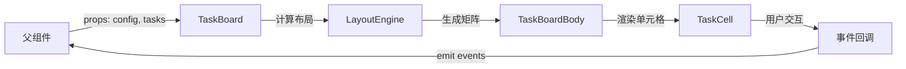

# 设计文档

## 概述

开发任务看板组件是一个基于 React/Vue 的可复用前端组件，采用表格布局展示团队成员的任务分配情况。组件采用数据驱动的设计模式，支持响应式布局、交互操作和自定义样式。

技术栈建议：
- React 18+ 或 Vue 3+（本设计以 React 为例）
- TypeScript 用于类型安全
- CSS Modules 或 Styled Components 用于样式隔离
- Day.js 用于日期处理

## 架构

### 组件层次结构

```
TaskBoard (容器组件)
├── TaskBoardHeader (表头组件)
│   ├── WeekHeader (周标题)
│   └── DateHeader (日期行)
├── TaskBoardBody (表体组件)
│   └── MemberRow (成员行) × N
│       ├── MemberCell (成员信息单元格)
│       └── TaskCell (任务单元格) × M
└── TaskTooltip (任务提示框)
```

### 数据流



## 组件和接口

### 1. TaskBoard 主组件

主容器组件，负责接收配置、处理数据和协调子组件。

**Props 接口：**

```typescript
interface TaskBoardProps {
  // 配置项
  config: BoardConfig;
  // 任务数据
  tasks: Task[];
  // 成员列表
  members: Member[];
  // 事件回调
  onTaskClick?: (task: Task) => void;
  onTaskUpdate?: (task: Task) => void;
  onCellClick?: (member: Member, date: Date) => void;
  // 样式定制
  className?: string;
  style?: React.CSSProperties;
}

interface BoardConfig {
  // 日期范围
  startDate: Date;
  endDate: Date;
  // 每周起始日（0=周日, 1=周一）
  weekStartDay?: 0 | 1;
  // 是否启用编辑模式
  editable?: boolean;
  // 颜色主题
  colorScheme?: ColorScheme;
  // 是否显示周末
  showWeekends?: boolean;
}
```

### 2. 数据模型

**Task 任务模型：**

```typescript
interface Task {
  id: string;
  // 任务名称
  title: string;
  // 所属成员 ID
  memberId: string;
  // 开始日期
  startDate: Date;
  // 结束日期
  endDate: Date;
  // 任务状态
  status: TaskStatus;
  // 自定义颜色（可选）
  color?: string;
  // 任务描述（用于 tooltip）
  description?: string;
  // 其他元数据
  metadata?: Record<string, any>;
}

type TaskStatus = 
  | 'pending'    // 待开始
  | 'inProgress' // 进行中
  | 'completed'  // 已完成
  | 'blocked'    // 阻塞
  | 'review';    // 评审中

interface Member {
  id: string;
  // 成员姓名
  name: string;
  // 岗位/角色
  role: string;
  // 头像（可选）
  avatar?: string;
}
```

### 3. 颜色方案

```typescript
interface ColorScheme {
  pending: string;      // 默认: #FFF9C4 (浅黄)
  inProgress: string;   // 默认: #BBDEFB (浅蓝)
  completed: string;    // 默认: #C8E6C9 (浅绿)
  blocked: string;      // 默认: #FFCDD2 (浅红)
  review: string;       // 默认: #F0F4C3 (浅绿黄)
}

// 默认颜色方案
const DEFAULT_COLOR_SCHEME: ColorScheme = {
  pending: '#FFF9C4',
  inProgress: '#BBDEFB',
  completed: '#C8E6C9',
  blocked: '#FFCDD2',
  review: '#F0F4C3',
};
```

### 4. LayoutEngine 布局引擎

负责计算日期范围、周分组和任务单元格的跨列逻辑。

```typescript
class LayoutEngine {
  /**
   * 生成日期序列
   */
  generateDateRange(
    startDate: Date,
    endDate: Date,
    showWeekends: boolean
  ): Date[];

  /**
   * 按周分组日期
   */
  groupDatesByWeek(
    dates: Date[],
    weekStartDay: 0 | 1
  ): WeekGroup[];

  /**
   * 计算任务的跨列信息
   */
  calculateTaskSpan(
    task: Task,
    dateRange: Date[]
  ): TaskSpan;

  /**
   * 构建成员-日期矩阵
   */
  buildMatrix(
    members: Member[],
    tasks: Task[],
    dateRange: Date[]
  ): CellMatrix;
}

interface WeekGroup {
  weekNumber: number;
  weekLabel: string; // "第一周", "第二周"
  dates: Date[];
  startIndex: number;
  endIndex: number;
}

interface TaskSpan {
  startIndex: number;
  colSpan: number;
}

interface CellMatrix {
  [memberId: string]: {
    [dateKey: string]: Task | null;
  };
}
```

### 5. TaskCell 任务单元格组件

```typescript
interface TaskCellProps {
  task: Task | null;
  member: Member;
  date: Date;
  colSpan: number;
  colorScheme: ColorScheme;
  editable: boolean;
  onClick?: () => void;
  onUpdate?: (task: Task) => void;
}
```

**渲染逻辑：**
- 如果 `task` 为 null，渲染空单元格
- 如果 `colSpan > 1`，使用 CSS `grid-column: span ${colSpan}` 或 HTML `colSpan` 属性
- 根据 `task.status` 或 `task.color` 设置背景色
- 文本过长时截断，并在 hover 时显示完整内容

## 数据模型

### 内部状态管理

```typescript
interface TaskBoardState {
  // 计算后的日期范围
  dateRange: Date[];
  // 周分组信息
  weekGroups: WeekGroup[];
  // 单元格矩阵
  cellMatrix: CellMatrix;
  // 任务跨列映射
  taskSpanMap: Map<string, TaskSpan>;
  // 当前悬停的任务
  hoveredTask: Task | null;
  // 编辑中的任务
  editingTask: Task | null;
}
```

### 数据处理流程

1. **初始化阶段**：
   - 接收 `config`、`tasks`、`members` props
   - 使用 `LayoutEngine.generateDateRange()` 生成日期序列
   - 使用 `LayoutEngine.groupDatesByWeek()` 进行周分组

2. **矩阵构建**：
   - 遍历 `members` 和 `dateRange`，初始化空矩阵
   - 遍历 `tasks`，计算每个任务的 `TaskSpan`
   - 将任务填充到矩阵的起始位置，后续位置标记为 `occupied`

3. **渲染阶段**：
   - 遍历矩阵，渲染 `TaskCell`
   - 跳过被标记为 `occupied` 的单元格（已被跨列任务占用）

## 样式设计

### 表格布局

使用 CSS Grid 实现固定表头和首列：

```css
.task-board {
  display: grid;
  grid-template-columns: 150px repeat(auto-fill, 80px);
  overflow: auto;
  max-height: 80vh;
}

.task-board-header {
  position: sticky;
  top: 0;
  z-index: 10;
  background: #fff;
}

.member-cell {
  position: sticky;
  left: 0;
  z-index: 5;
  background: #fff;
}

.task-cell {
  border: 1px solid #e0e0e0;
  padding: 8px;
  min-height: 60px;
  display: flex;
  align-items: center;
  justify-content: center;
  text-align: center;
  cursor: pointer;
  transition: opacity 0.2s;
}

.task-cell:hover {
  opacity: 0.8;
  box-shadow: 0 2px 4px rgba(0,0,0,0.1);
}

.task-cell-span {
  grid-column: span var(--col-span);
}
```

### 响应式设计

```css
@media (max-width: 768px) {
  .task-board {
    grid-template-columns: 100px repeat(auto-fill, 60px);
  }
  
  .task-cell {
    font-size: 12px;
    padding: 4px;
    min-height: 50px;
  }
}
```

### 颜色对比度

确保文本可读性，使用辅助函数计算文本颜色：

```typescript
function getContrastColor(backgroundColor: string): string {
  // 计算亮度
  const rgb = hexToRgb(backgroundColor);
  const brightness = (rgb.r * 299 + rgb.g * 587 + rgb.b * 114) / 1000;
  
  // 亮度 > 128 使用深色文本，否则使用浅色文本
  return brightness > 128 ? '#000000' : '#FFFFFF';
}
```

## 错误处理

### 数据验证

```typescript
function validateTaskData(tasks: Task[]): ValidationResult {
  const errors: string[] = [];
  
  tasks.forEach((task, index) => {
    if (!task.id) {
      errors.push(`Task at index ${index} missing id`);
    }
    if (!task.memberId) {
      errors.push(`Task ${task.id} missing memberId`);
    }
    if (task.startDate > task.endDate) {
      errors.push(`Task ${task.id} has invalid date range`);
    }
  });
  
  return {
    valid: errors.length === 0,
    errors,
  };
}
```

### 错误边界

```typescript
class TaskBoardErrorBoundary extends React.Component {
  state = { hasError: false, error: null };
  
  static getDerivedStateFromError(error: Error) {
    return { hasError: true, error };
  }
  
  render() {
    if (this.state.hasError) {
      return (
        <div className="error-container">
          <h3>任务看板加载失败</h3>
          <p>{this.state.error?.message}</p>
        </div>
      );
    }
    return this.props.children;
  }
}
```

### 边界情况处理

1. **空数据**：显示空状态提示
2. **日期范围过大**：限制最大显示天数（如 90 天），超出时显示警告
3. **任务重叠**：同一成员同一天有多个任务时，垂直堆叠或显示计数
4. **无效日期**：过滤掉无效的任务数据，记录警告日志

## 测试策略

### 单元测试

1. **LayoutEngine 测试**：
   - 测试日期范围生成（包含/不包含周末）
   - 测试周分组逻辑（周一/周日起始）
   - 测试任务跨列计算
   - 测试矩阵构建

2. **数据验证测试**：
   - 测试各种无效数据场景
   - 测试边界条件

3. **颜色工具测试**：
   - 测试对比度计算
   - 测试颜色转换函数

### 集成测试

1. **组件渲染测试**：
   - 测试基本渲染
   - 测试跨日任务渲染
   - 测试空状态渲染

2. **交互测试**：
   - 测试单元格点击事件
   - 测试 hover 提示显示
   - 测试编辑模式

3. **响应式测试**：
   - 测试不同视口尺寸下的布局
   - 测试滚动行为
   - 测试固定表头/首列

### 性能测试

1. **大数据量测试**：
   - 测试 100+ 成员、1000+ 任务的渲染性能
   - 测试滚动流畅度

2. **内存泄漏测试**：
   - 测试组件挂载/卸载
   - 测试数据更新时的内存使用

## 性能优化

### 虚拟滚动

对于大量数据，实现虚拟滚动只渲染可见区域：

```typescript
// 使用 react-window 或自定义虚拟滚动
import { FixedSizeGrid } from 'react-window';

function VirtualTaskBoard({ cellMatrix, dateRange, members }) {
  return (
    <FixedSizeGrid
      columnCount={dateRange.length + 1}
      rowCount={members.length + 1}
      columnWidth={80}
      rowHeight={60}
      height={600}
      width={1000}
    >
      {CellRenderer}
    </FixedSizeGrid>
  );
}
```

### Memoization

```typescript
// 使用 React.memo 避免不必要的重渲染
const TaskCell = React.memo(({ task, ...props }) => {
  // ...
}, (prevProps, nextProps) => {
  return prevProps.task?.id === nextProps.task?.id &&
         prevProps.task?.status === nextProps.task?.status;
});

// 使用 useMemo 缓存计算结果
const cellMatrix = useMemo(() => {
  return layoutEngine.buildMatrix(members, tasks, dateRange);
}, [members, tasks, dateRange]);
```

### 懒加载

```typescript
// 延迟加载非关键功能
const TaskTooltip = lazy(() => import('./TaskTooltip'));
const TaskEditor = lazy(() => import('./TaskEditor'));
```

## 可访问性

1. **键盘导航**：
   - 支持 Tab 键在单元格间导航
   - 支持 Enter 键打开任务详情
   - 支持方向键在表格中移动

2. **ARIA 属性**：
```typescript
<div
  role="grid"
  aria-label="团队任务看板"
  aria-rowcount={members.length}
  aria-colcount={dateRange.length}
>
  <div role="row" aria-rowindex={1}>
    <div role="columnheader" aria-colindex={1}>
      成员
    </div>
  </div>
</div>
```

3. **屏幕阅读器支持**：
   - 为任务单元格添加 `aria-label`
   - 为状态颜色添加文本说明

4. **焦点管理**：
   - 确保焦点可见
   - 模态框打开时锁定焦点

## 扩展性考虑

### 插件系统

预留插件接口，支持自定义功能：

```typescript
interface TaskBoardPlugin {
  name: string;
  onCellRender?: (cell: TaskCell) => React.ReactNode;
  onTaskClick?: (task: Task) => void;
  customActions?: Action[];
}

// 使用示例
<TaskBoard
  plugins={[
    exportPlugin,
    filterPlugin,
    customStatusPlugin,
  ]}
/>
```

### 主题定制

```typescript
interface Theme {
  colors: ColorScheme;
  fonts: {
    family: string;
    size: {
      small: string;
      medium: string;
      large: string;
    };
  };
  spacing: {
    cellPadding: string;
    cellGap: string;
  };
  borders: {
    width: string;
    color: string;
    radius: string;
  };
}
```

### 国际化

```typescript
interface I18nConfig {
  locale: 'zh-CN' | 'en-US' | string;
  messages: {
    weekLabel: (n: number) => string;
    dayNames: string[];
    emptyState: string;
    errorMessages: Record<string, string>;
  };
}
```
